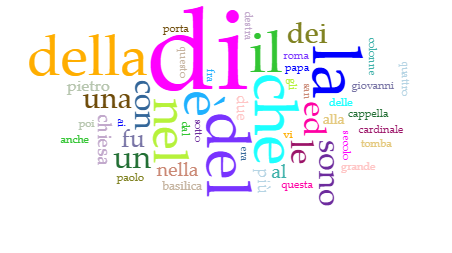

# Visualizzazione dei dati

## Immagini

La cartella contiene le visualizzazioni dei dati estratti tramite [Voyant Tools](https://voyant-tools.org/) in formato `.png`. In particolare, contiene:
  * [og_cirrus](https://github.com/ggdrll/esame/blob/main/docs/viz/og_cirrus.png): la visualizzazione word cloud delle parole più frequenti nel documento, **senza modifiche alle stopwords**;
  * [og_bubblelines_rows](https://github.com/ggdrll/esame/blob/main/docs/viz/og_bubblelines_rows.png): la visualizzazione di frequenza e distribuzione delle 5 parole più utilizzate nel documento, **senza modifiche alle stopwords**;
  * [og_bubbleline_IT](https://github.com/ggdrll/esame/blob/main/docs/viz/og_bubblelines_IT.png): la visualizzazione di frequenza e distribuzione delle 5 parole più utilizzate nel documento, **escluse le stopwords individuate dallo strumento per la lingua italiana**;
  * [bubblelines_IT_rows](https://github.com/ggdrll/esame/blob/main/docs/viz/bubblelines_IT_rows.png): la visualizzazione di frequenza e distribuzione delle 5 parole più utilizzate nel documento, **escluse le stopwords individuate dallo strumento per la lingua italiana e altre integrate dalla sottoscritta**;
  * [bubblelines_art](https://github.com/ggdrll/esame/blob/main/docs/viz/bubblelines_art.png): la visualizzazione di frequenza e distribuzione delle prime **10 parole inerenti a elementi artistici e architettonici individuate dalla sottoscritta** entro le 50 parole più utilizzate nel documento, **escluse le stopwords individuate dallo strumento per la lingua italiana e altre integrate dalla sottoscritta**;
  * [bubblelines_archives-libraries](https://github.com/ggdrll/esame/blob/main/docs/viz/bubblelines_archives-libraries.png): la visualizzazione di frequenza e distribuzione delle **parole inerenti a elementi archivistico-librari, selezionate dalla sottoscritta**.

## Tabelle

All'interno del file [bubblelines_tabs](https://github.com/ggdrll/esame/blob/main/docs/viz/bubblelines_tabs.xlsx) sono riportati dei fogli di lavoro in formato `.xlsx` corrispondenti (con lo stesso nome) ad ogni immagine in visualizzazione [Bubblelines](https://voyant-tools.org/docs/#!/guide/bubblelines). Ciascun foglio di lavoro contiene:
* l'elenco delle parole rappresentate;
* il numero che indica la frequenza di ciascuna all'interno del testo.

## Stopwords

L'*elenco delle stopwords integrate* personalmente a quelle rilevate dallo strumento d'analisi è il seguente (rilevate entro le 100 parole più frequenti):
1) s
2) é
3) roma
4) secolo
5) fra
6) sotto
7) pit
8) 1
9) destra
10) sinistra
11) poi
12) ii
13) presso
14) iv
15) ss
16) v
17) qui
18) lato
19) iii
20) de
21) sopra
22) prima
23) dopo
24) oggi
25) qui
26) quando
27) gia
28) ix
29) 2
30) essa
31) viii
32) ancora
33) forse
34) detto
35) esso
36) 3
37) verso
38) piu
